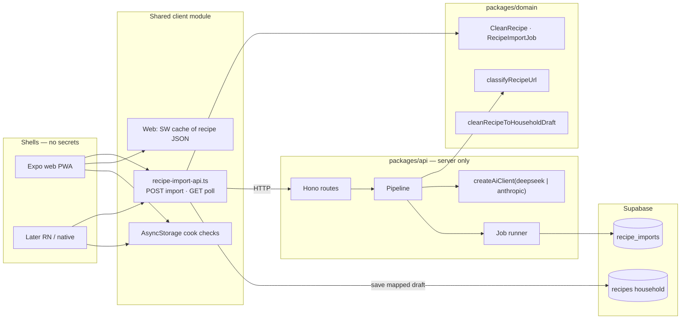
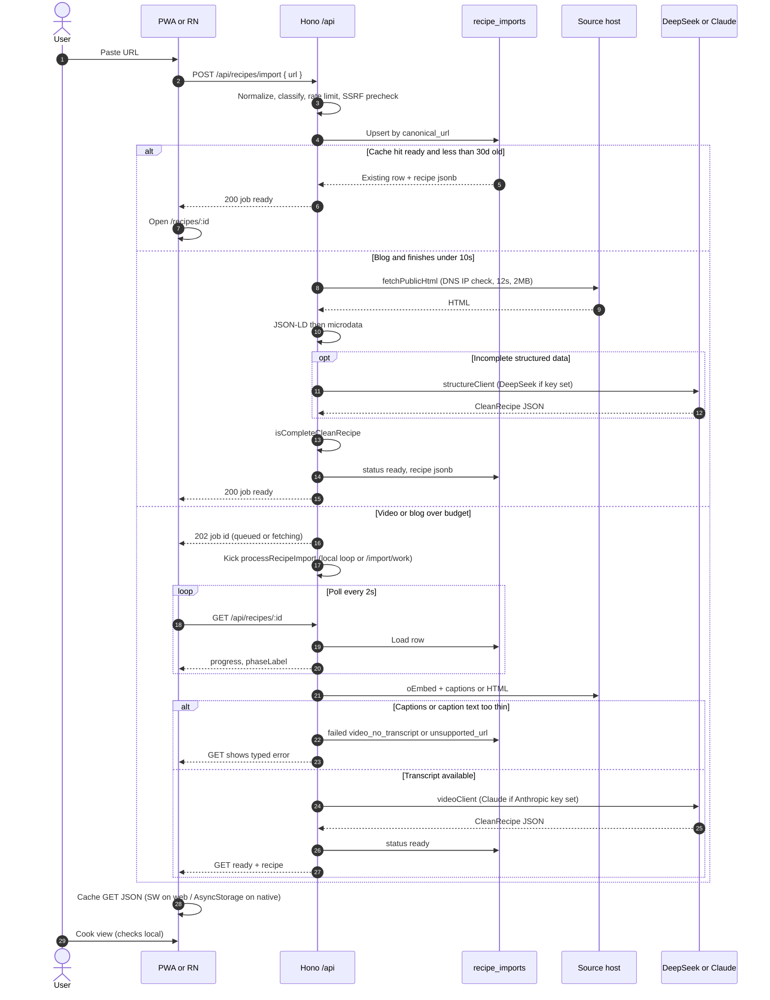
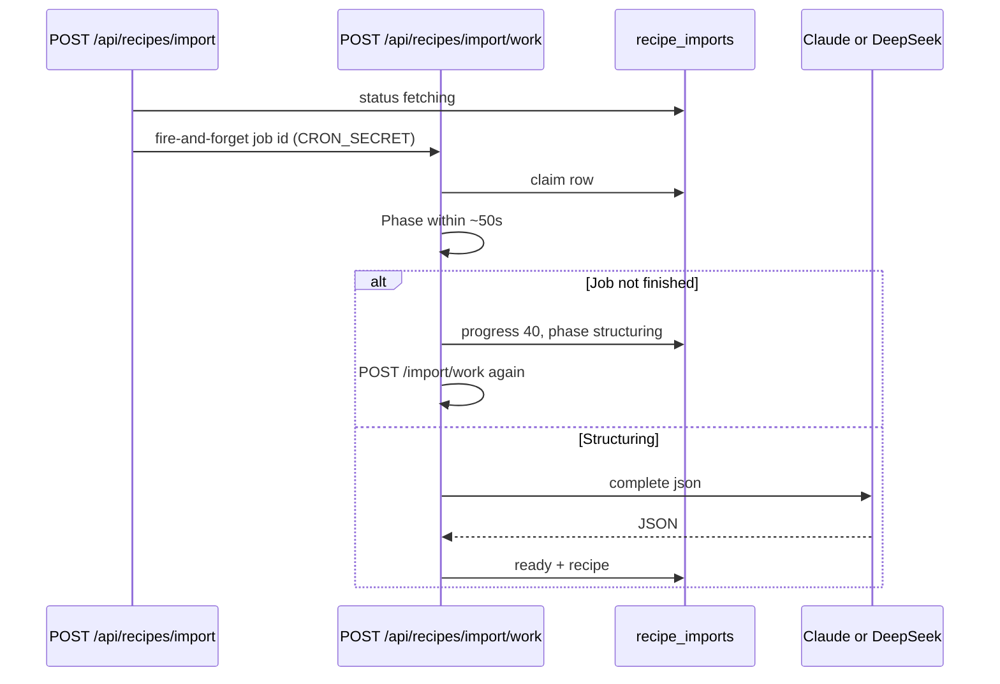
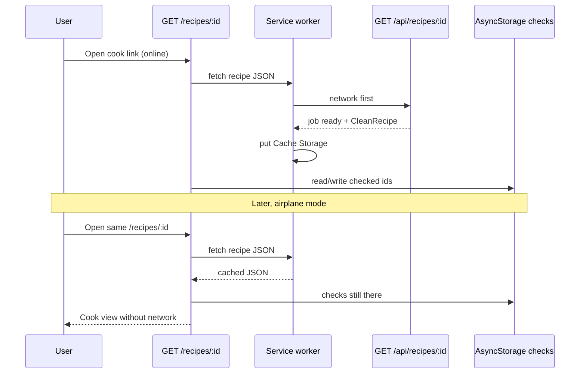

# Recipe import architecture

Companion to [prd-clean-recipe-from-url.md](./prd-clean-recipe-from-url.md) and `@kinexus/domain` types in `packages/domain/src/meals/clean-recipe.ts`.

This is the implementation contract. No UI in this step.

---

## Goals

- PWA now; **the same HTTP API** is what a later React Native / native shell calls. No browser-only scrape, no DOM parser in the Expo app.
- Reuse `packages/api/.env` keys and `createAiClient()`. Prefer **DeepSeek** for cheap structuring; **Claude** for hard video. No new secret files.
- Blog JSON-LD may finish in one request (**&lt;10s**). Video is always an **async job** (1–3+ minutes) with **polling** (SSE optional on long-lived Node only).
- Cache by **canonical URL**. SSRF-safe fetch. Rate limit per user/IP.
- Once a cook recipe is saved (or a completed import JSON is cached locally), the **cook view and ingredient checks work offline**.

---

## Current stack (constraints)

| Piece | Today | Import implication |
| --- | --- | --- |
| `apps/kinexus` | Expo Router, web `output: "static"` on Vercel | Cook page is an Expo route. API is not the static host. |
| `packages/api` | Hono, mounted at `/` **and** `/api` | Register `/recipes/...` once; both `/api/recipes/import` and local `:5301/recipes/import` work. |
| Vercel | `api/[[...route]].ts`, `maxDuration: 60` | A TikTok-class job **cannot** be one invocation. Use **job row + chained work**. |
| Local API | Long-lived Node on `:5301` | Same job code, in-process loop (no chain). |
| LLM | `AI_PROVIDER`, `ANTHROPIC_*`, `DEEPSEEK_*` in `packages/api/.env` | Select client in code; do not add keys. |
| Scrape | `assertPublicHttpUrl` + 12s fetch, hostname-only private check | Reuse; add **DNS → IP** check. |
| Auth | `(app)` redirects to sign-in; `/scrape` and `/ai` require JWT | Import POST is **optional JWT**. Cook GET is public. Save stays household RLS. |
| Offline | Slot **outbox** only; **no service worker** | Add a **web SW** for recipe JSON; checks live in AsyncStorage (web + native). |
| Persist | `public.recipes` is catalog + household | Do **not** stuff import cache into catalog. New `recipe_imports` table. |

Existing `/scrape` + `/ai` stay until the cook UI replaces the form. The new pipeline does **not** call `extract_recipe_from_url`.

---

## Shared core vs shells



| Layer | Lives in | Native later |
| --- | --- | --- |
| Types, URL classify, completeness, save mapping | `@kinexus/domain` | Same package |
| Fetch, SSRF, JSON-LD, microdata, captions, LLM, jobs, cache | `packages/api` | Same API |
| HTTP client + poll loop | `apps/kinexus/src/lib/recipe-import-api.ts` (not built this step) | Same module |
| Cook screen | Expo route (not this step) | Same screen |
| Service worker | Web only | Skip; persist last JSON in AsyncStorage instead |

---

## Routes

Hono already serves the same router at `/` and `/api`. Vercel’s function is `/api/*`. **Clients always call the `/api` prefix** so PWA (same origin) and native (`EXPO_PUBLIC_API_URL`) match.

| Method | Path | Auth | Role |
| --- | --- | --- | --- |
| `POST` | `/api/recipes/import` | Optional Bearer | Start or reuse import. Body `{ url: string }`. |
| `GET` | `/api/recipes/:id` | None | Job status + `CleanRecipe` when `ready`. Poll target. |
| `POST` | `/api/recipes/import/work` | `CRON_SECRET` (same pattern as `/prices/refresh`) | Internal continuation. Not for apps. |
| `GET` | `/recipes/:id` | None (Expo, **outside** `(app)`) | Cook **page**. Fetches `/api/recipes/:id`. |
| `GET` | `/https://…` or `/https:/…` | None | Prefix shortcut → cook/import flow. |

**Same `:id`** for POST response, GET status, and cook page: `recipe_imports.id`.

### POST `/api/recipes/import`

```json
{ "url": "https://www.youtube.com/watch?v=…" }
```

Responses:

- **200** — already `ready` (cache hit or blog finished in the 10s budget). Body: `RecipeImportJob` with `recipe`.
- **202** — accepted, still running. Body: `RecipeImportJob` (`queued` / `fetching` / …). Client polls GET.
- **4xx/429/503** — typed `errorCode` from the PRD (`invalid_url`, `unsupported_url`, `ssrf_blocked`, `rate_limited`, …).

If a row for this **canonical URL** is already `ready`, return that id (cache). If it is in progress, return that id (coalesce). If it `failed` and is older than 15 minutes, retry in place.

### GET `/api/recipes/:id`

Returns `GetRecipeImportResponse` (`{ job }`). When `status === 'ready'`, `job.recipe` is the cook payload. This JSON is what the **service worker caches**.

### GET `/recipes/:id` (page)

Expo route `app/recipes/[id].tsx` **not** nested under `(app)` so guests are not redirected to Google. Vercel rewrite (same pattern as `/meals/recipes/:id`):

```json
{ "source": "/recipes/:id", "destination": "/index.html" }
```

### Prefix shortcut `/https://…`

Desired: `https://kinexus.app/https://allrecipes.com/recipe/…`.

Browsers and CDNs often collapse `https://` in the path to `https:/`. Accept all of:

- `/https://host/path`
- `/https:/host/path`
- `/https/host/path`

Rewrite those to the static app; a **later** public import screen parses the leftover path into a URL and POSTs import. Fallback query form: `/recipes/import?url=`.

Do not implement the screen now; ship the rewrite plan so the path is reserved:

```json
{ "source": "/https/:path*", "destination": "/index.html" }
```

Register the Hono route `/recipes/import` **before** `/recipes/:id` so `import` is not parsed as an id.

---

## Data: one row per canonical URL

Do not mix this with `public.recipes` (catalog / household). Service role writes cache; anon **select** by primary key only (no list-all).

```sql
create table public.recipe_imports (
  id uuid primary key default gen_random_uuid(),
  input_url text not null,
  canonical_url text not null unique,
  source_kind text, -- web | youtube | tiktok | instagram | facebook
  status text not null, -- RecipeImportPhase
  progress integer not null default 0 check (progress between 0 and 100),
  phase_label text not null default '',
  error_code text,
  error_message text,
  recipe jsonb, -- CleanRecipe when ready
  extraction_method text,
  provider text, -- anthropic | deepseek | null for json-ld/microdata
  created_at timestamptz not null default now(),
  updated_at timestamptz not null default now(),
  expires_at timestamptz not null,
  last_accessed_at timestamptz not null default now()
);

create table public.recipe_import_rate (
  bucket text not null, -- 'ip:' || sha256 or 'user:' || uuid
  window_start timestamptz not null,
  count integer not null default 0,
  primary key (bucket, window_start)
);
```

- Cache hit = `canonical_url` match and `status = 'ready'` and `updated_at` within **30 days**.
- Job wall clock: `expires_at = now() + 3 minutes`. Poller maps overdue non-ready rows to `timeout`.
- Store **hashed IP**, never raw, on the rate table only.
- `recipe` jsonb is the offline/PWA payload.

Household **Save to My Recipes** stays the existing Supabase insert into `recipes` via `cleanRecipeToHouseholdDraft`. No second write path.

---

## Pipeline

```
url
  → normalize / classify
  → SSRF-safe fetch (or platform caption path)
  → extract JSON-LD → microdata → LLM
  → validate isCompleteCleanRecipe
  → persist recipe_imports
  → return job
```

### 1. Normalize + classify (`@kinexus/domain`, pure)

- Trim, require `http:` / `https:`.
- Lowercase host; strip hash; strip `utm_*`, `fbclid`, `igshid`, `si`.
- YouTube → `https://www.youtube.com/watch?v=ID` (reuse stash link canonicalization).
- TikTok → host + `/video/ID` when present.
- Instagram → `/reel/ID` or `/p/ID`.
- Facebook → `/share/r/ID`, `/reel/ID`, `/watch/?v=ID`, or `fb.watch/ID`. Fetch `m.facebook.com` (desktop HTML is often HTTP 400).
- Classify: `web` | `youtube` | `tiktok` | `instagram` | `facebook` | throw `unsupported_url` (non-http, unknown app-link schemes).

### 2. SSRF-safe fetch (extend `packages/api/src/scrape/index.ts`)

Keep `fetchPublicHtml` (12s, 4 hops, 2 MB cap). Add:

- `dns.promises.lookup` on the **final** hostname; reject private / loopback / link-local / ULA / metadata **IPs** (closes DNS rebinding the hostname-string check misses).
- Re-check protocol + IP on **every** redirect hop.
- Reject `file:`, `data:`, credentials in URL.
- Timeouts: DNS 2s, HTTP 12s.
- Log host + job id only — never keys, never full HTML.

Video hosts may skip HTML if we have an oEmbed + caption API; still SSRF-check those endpoints (allowlist `youtube.com`, `i.ytimg.com`, etc.).

### 3. Detect blog vs video

| Kind | Sync allowed? | Extract |
| --- | --- | --- |
| `web` | Yes if done in **10s** | HTML → JSON-LD → microdata → strip text → LLM |
| `youtube` | No (always **202**) | oEmbed + `ytInitialPlayerResponse` description + public caption tracks → LLM |
| `tiktok` / `instagram` | No (always **202**) | oEmbed / OG caption or description → LLM; empty text → `not_a_recipe` |
| `facebook` | No (always **202**) | Mobile OG caption + crawler comments; follow off-platform recipe links in comments; login wall / HTTP 400 → `unsupported_url`, not timeout |

Never download media files. Canonicalize Shorts / `youtu.be` / `?si=` share links to `https://www.youtube.com/watch?v=VIDEO_ID` **before** fetch and cache keys. Tracking params are never required.

POST `/api/recipes/import` must not wait on video work (minutes). Job wall clock is **3 minutes**; overdue `queued`/`running` → `timeout` (“try again”), distinct from `not_a_recipe` (“Recipe not found”). Timeout failures are retried in place; other failures stay cached 15 minutes.

### 4. Extract order

1. **JSON-LD** `schema.org/Recipe` (existing `extractJsonLdRecipe`). Incomplete (no ingredients **or** no steps) → continue. Preserve `HowToSection` as `heading` blocks (today’s scraper flattens — stop flattening).
2. **Microdata** `itemtype` Recipe / `itemprop` `recipeIngredient`, `recipeInstructions`, `name`, `recipeYield`, `image`. Same completeness rule.
3. **LLM structure** of stripped HTML or caption text via the clients below. Prompt: extract only what is in the content; if not a recipe, return a JSON failure object the handler maps to `not_a_recipe`. **Do not invent.**

### 5. Validate

`isCompleteCleanRecipe`: non-empty title, ≥1 named ingredient, ≥1 step. Failure → `not_a_recipe` or `extraction_failed`, never a 200 cook view.

### 6. Persist + return

Write jsonb + `status: ready`. Attribution `sourceUrl` = canonical; `inputUrl` = what the user pasted.

---

## LLM: existing env only

No new `.env` files, no new key names, never `EXPO_PUBLIC_*`.

| Env (already in `packages/api/.env`) | Role |
| --- | --- |
| `DEEPSEEK_API_KEY` (+ optional `DEEPSEEK_BASE_URL` / `DEEPSEEK_MODEL`) | Cheap structuring |
| `ANTHROPIC_API_KEY` (+ optional base/model) | Hard video + fallback |
| `AI_PROVIDER` | Default when only one key is set (`createAiClient()`) |

```
structureClient =
  DEEPSEEK_API_KEY present ? createAiClient('deepseek') : createAiClient()

fallbackClient =
  the other provider, if that key exists
```

Web **and** video both use **DeepSeek first**, Claude fallback. (Earlier drafts preferred Claude for long transcripts; live quality was not worth a different path. Whisper is the follow-up when captions are missing — below.)

If `AI_PROVIDER=deepseek` and Anthropic is unset, video uses DeepSeek. If DeepSeek is unset, everything uses `createAiClient()` (today’s Anthropic default). Keys missing → 503 “import isn’t configured”; never prompt the user for a key.

Reuse `extractRecipeFromText`’s JSON-object parsing (`parseJsonObject` + a `CleanRecipe` normalizer). **Do not** call `extractRecipeFromUrlHint`.

While a job is `queued` or `running`, GET overlays rotating copy (`Fetching…` → `Reading the recipe…` → `Summarizing with AI…` → `Almost there…`) and a soft progress estimate. Logs: `{ jobId, host, sourceKind, videoId, provider: deepseek|claude|anthropic, latencyMs, status }` — never API keys, never HTML.

### Follow-up: Whisper / ASR when captions are missing

Public YouTube caption tracks and TikTok/IG captions are best-effort. Cooking Shorts often put the recipe in the **description**; we already send that to the LLM. When there is **no** caption track and the description is too thin, we fail with **Recipe not found** rather than inventing steps.

A later step can add **speech-to-text** (Whisper or an equivalent hosted ASR) on a short audio-only extract — still **no** full video download, still SSRF-safe, still DeepSeek/Claude for structuring. Out of scope until caption/description coverage is the limiter in production logs (`hasCaptions: false` + `not_a_recipe`).

---

## Jobs: 10s blog sync vs video async

Vercel function budget is **60s**. PRD video budget is **minutes**. Split work.

### Blog (web)

In `POST /api/recipes/import`:

1. Insert/upsert row `queued`.
2. Run the pipeline with a **10s wall-clock** budget (AbortSignal).
3. If `ready` in time → **200**.
4. If still working (slow HTML, LLM) → commit progress, **202**, kick work continuation.

### Video

Always **202** after insert. Kick work immediately.

### Work runner

`processRecipeImport(id)` runs the next phase, updates `progress` / `phase_label`, stops at ~**50s** of invocation time.

| Environment | How the runner is scheduled |
| --- | --- |
| Local Node `:5301` | `setImmediate` / in-process loop until `ready` \| `failed` \| expiry |
| Vercel | `POST /api/recipes/import/work` `{ id }` with `Authorization: Bearer CRON_SECRET`. End of an invocation **chains** another POST to self if not done. Optional `waitUntil` so POST import can return 202 without waiting. |

Phases (map to `RecipeImportPhase` + `phaseLabel`):

1. `validating` — URL / SSRF  
2. `fetching` — HTML or oEmbed  
3. `reading_structured_data` — JSON-LD / microdata  
4. `extracting_transcript` — captions (video)  
5. `structuring` — LLM  
6. `ready` / `failed` / `cancelled`

### Polling vs SSE

- **Contract for PWA and native:** poll `GET /api/recipes/:id` every 2s (backoff to 5s after 30s). Stop on `ready` | `failed` | `cancelled` or `expires_at`.
- **SSE** (`GET /api/recipes/:id/events`) is optional on the long-lived Node server only. Do not rely on it on Vercel (idle connections die). Native should not need EventSource.



Continuation (Vercel only):



---

## Security

| Control | Rule |
| --- | --- |
| SSRF | http(s) only; block private hostnames **and** resolved IPs; re-validate redirects; allowlist video oEmbed hosts. |
| Timeouts | DNS 2s, HTML 12s, LLM 45s, job 4 min, blog sync 10s. |
| Size | URL ≤ 2048 chars; HTML 2 MB; caption/text to LLM ≤ 100 k chars; recipe jsonb ≤ 256 KB. |
| Rate limit | Guest: **5** imports / hour / IP hash (cache hits count as 1 cheap unit, cap 30/hour). Signed-in: **20** / hour / `user_id`. Over → `rate_limited`. |
| Auth | POST optional JWT (higher cap). GET public by UUID. Work endpoint secret-only. |
| Secrets | Only `packages/api/.env` / Vercel project env. Never log `Authorization`, API keys, or HTML bodies. |
| Attribution | `CleanRecipe.attribution.sourceUrl` always set; cook page must link out (UI later). |
| Paywall | 401/403 → `blocked`, not Claude reconstruction. |

Optional JWT on POST: `userFromRequest` if `Authorization` present; if missing, continue as guest. Do not 401 guests.

---

## Offline PWA

Import **starts** only while online (existing meals online gate). After a job is `ready`:

1. **Recipe JSON** — `GET /api/recipes/:id` is stored in:
   - **Web:** Cache Storage via a small service worker (`kinexus-recipes-v1`), network-first then cache. Register from a web-only module; Expo static export has no SW today.
   - **Native later:** same JSON in AsyncStorage (`kinexus.cookRecipe.${id}`). No SW.
2. **Checked ingredients** — **not** on the server. AsyncStorage key `kinexus.cookChecks.${id}` = `string[]` of ingredient ids. Works offline on web and native without the SW.
3. **Serving scale** — session/memory; not required offline beyond the current session.
4. **Household save** — once `cleanRecipeToHouseholdDraft` is written to `recipes`, the existing meals sync cache can show a cook view from that row (map headings from `# ` prefixes). SW is extra for **unsigned** cook links.

SW must **not** cache `POST /api/recipes/import` or HTML of third-party sites. Hero images are cross-origin; skip them offline rather than proxying (MVP).



---

## Client module (for later UI / native)

Not built in this step. Shape so RN can copy-paste:

```ts
postRecipeImport(url: string, token?: string): Promise<RecipeImportJob>
getRecipeImport(id: string): Promise<RecipeImportJob>
pollRecipeImport(id, { intervalMs, signal }): AsyncIterable<RecipeImportJob>
```

Base URL: `EXPO_PUBLIC_API_URL` or same-origin `''` on Vercel web (rewrites). Paths always `/api/recipes/...`.

---

## File plan (when implementing)

| Path | Responsibility |
| --- | --- |
| `packages/domain/src/meals/clean-recipe.ts` | Types (exists) |
| `packages/domain/src/meals/recipe-url.ts` | Normalize + classify |
| `packages/db/supabase/migrations/*_recipe_imports.sql` | Tables + RLS |
| `packages/api/src/scrape/index.ts` | DNS IP SSRF |
| `packages/api/src/recipes/extract-jsonld.ts` | JSON-LD + HowToSection |
| `packages/api/src/recipes/extract-microdata.ts` | Microdata |
| `packages/api/src/recipes/extract-video.ts` | Host adapters dispatcher |
| `packages/api/src/recipes/adapters/youtube.ts` | oEmbed + player JSON + timedtext |
| `packages/api/src/recipes/adapters/tiktok.ts` | oEmbed + OG caption |
| `packages/api/src/recipes/adapters/instagram.ts` | OG caption |
| `packages/api/src/recipes/adapters/facebook.ts` | Mobile OG + oEmbed caption |
| `packages/api/src/recipes/structure-llm.ts` | DeepSeek / Claude routing |
| `packages/api/src/recipes/pipeline.ts` | Orchestration |
| `packages/api/src/recipes/jobs.ts` | process + chain |
| `packages/api/src/app.ts` | Register routes |
| `vercel.json` | Rewrites + keep `maxDuration: 60` |
| `apps/kinexus/public/sw-recipes.js` | Cache GET JSON (with cook UI) |

---

## Out of scope here

Cook UI, prefix-shortcut screen, SSE, nutrition, unit toggle, TTS, PDF, shopping-list push, yt-dlp / media download, new API key files.
